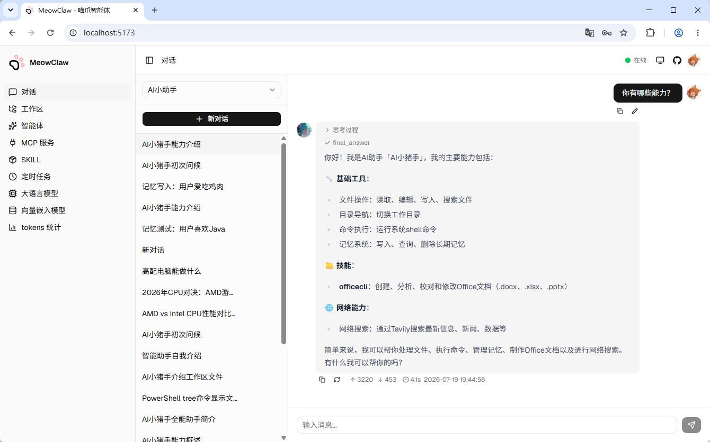
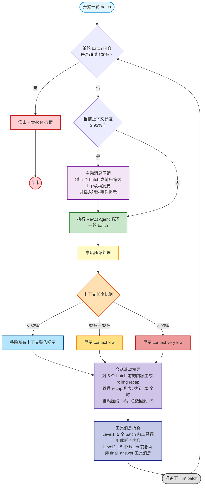

# MeowClaw 喵爪智能体

可自托管的单用户通用ReAct风格智能体工具。



## 核心特性

### 登录鉴权

MeowClaw是一个单用户系统，管理员用户有所有操作权限，首次使用需创建管理员账户，后续可在后台修改用户名及密码。

### 智能体

MeowClaw的核心功能是执行ReAct风格的智能体，在智能体管理菜单创建智能体，可配置的信息包括：

- 智能体名称：给智能体起的名字。
- 头像：可以上传一个图片显示在智能体对话气泡旁边。
- 人设：描述智能体该以哪种身份、如何与用户交互，该部分会固定注入系统提示词，在每一次与大语言模型交互时都携带该信息。
- 启用内置工具：配置智能体可使用的工具。
- 启用MCP工具：配置智能体可使用的外部工具。
- 关联LLM：智能体使用的大语言模型配置。
- 工作区路径：智能体默认的工作目录。

#### 智能体多轮对话

MeowClaw的多“轮”对话中，1个轮（batch）是指1次完整智能体交互，其中包含1条用户消息（User Message）和若干工具调用消息（带Tool Call的Assistant Message，可能还包含reasoning信息）与工具消息（Tool Message，调用工具的返回值），最后一条工具消息通常是`final_answer`工具调用，意味着智能体结束工作并提交结果显示给前端用户。虽然1个batch会合并显示在1个对话气泡中，但1个batch可能包含数十次迭代，每个迭代都会调用大语言模型接口。多轮对话中，较早的batch会根据配置的大语言模型上下文大小自动进行多级压缩，在尽量不丢失上下文记忆的前提下持续交互。

#### 智能体工作区

智能体工作区是智能体默认的工作目录，与智能体交互时，一次会话有独立的CWD（当前工作目录），它的默认值就是智能体工作区，这意味着智能体工作时产生的文件默认会优先写入自己的工作区中，而不是在操作系统中乱写。多个智能体可以配置相同的工作目录，但注意它们如果同时运行可能导致文件冲突。

左侧的工作区管理菜单是一个在线文件浏览器，在这里可以在线维护智能体的工作目录内的文件内容。

#### 内置工具

MeowClaw为所有智能体配备了以下工具，它们默认全部启用以实现完整的智能体能力，在智能体配置界面也可以关闭部分工具，或关闭全部工具将智能体作为纯粹的聊天机器人使用。

- `cd`：切换会话级的基础工作路径，默认值是工作区路径。
- `read`：读取文件。
- `edit`：编辑（更新）文件。
- `grep`：在文件中使用正则表达式搜索。
- `glob`：查找文件。
- `skill`：加载Agent Skill。
- `write`：追加或覆盖写文件。
- `exec`：执行Shell命令，同时支持Windows CMD和Bash环境。

#### MCP工具

MCP工具通常作为智能体可使用的外部工具，用户可以配置MCP工具来随意扩展智能体的能力，例如context7、Tavily、Firecrawl等，支持stdio、Streamable HTTP、SSE（Legacy）三种MCP交互协议。

#### Agent Skill

全局Agent Skill管理：MeowClaw中在左侧的SKILL菜单配置Agent Skill，在这里可以上传一个包含`SKILL.md`和其它附属文件（包括可执行脚本等）的ZIP格式压缩包，已上传的Agent Skill系统会自动读取`SKILL.md`的YAML Frontmatter并以卡片形式展示。该菜单只负责Agent Skill的上传、删除和展示，具体使用时，需要将其部署到一个智能体中。

部署Agent Skill到智能体：已上传的Agent Skill可以“部署”到一个智能体，这其实就是将压缩包解压到智能体工作区的`<智能体工作区>/.skill/`下，这个文件夹下的内容都会被拥有该工作目录的智能体识别为自己拥有的Agent Skill，并通过`skill`内置工具访问。“部署”是个一次性操作，UI上没有直接的删除或撤回按钮，如果想删除一个智能体的Agent Skill，需要在对应智能体工作目录的`<智能体工作区>/.skill/`下删除对应Agent Skill名字的文件夹，或者直接与智能体对话，让其删除工作空间内的某个Agent Skill。

#### 上下文压缩

MeowClaw为长流程对话而设计，上下文压缩分为多个层级。

- 水位线预警：1个batch（即1轮ReAct Agent交互完成，可能包含多次工具调用迭代）执行完成后，当上下文已达到最大上下文长度的`82%`和`93%`时，用户前端会看到`上下文不足`、`上下文严重不足`提示信息。
- 会话滚动摘要：1个batch执行完成后，会自动对5个batch之前的内容使用大语言模型生成滚动摘要（Rolling Recap）并注入系统提示词，每个batch生成一个滚动摘要，滚动摘要会在达到20个时自动压缩前1-6个为1个合并的滚动摘要（Rolled Up Recap），保持滚动摘要总数不超过20个。
- 工具消息折叠：智能体交互中，工具调用相关消息可能占用大量上下文，MeowClaw会自动“折叠”之前内容的工具调用信息，分两个层级：
  - Level1折叠：对于5个batch之前的工具调用消息，将返回值中字符数大于100的内容直接截断为“xxxxx... [此处因上下文压缩已截断]”。
  - Level2折叠：对于15个batch之前的交互，直接移除`final_answer`以外的全部工具调用消息，只保留用户输入和智能体最终回复。
- 主动消息压缩：在以上压缩基础上，1次交互前上下文占用仍大于`93%`时立即先触发主动消息压缩再执行任务，这一过程会根据tokens消耗计算将n（n>=0）个batch之前的消息暴力压缩为1个主动压缩滚动摘要（Proactive Recap），以腾出上下文空间继续执行任务。

具体执行流程如下。



### 定时任务

定时任务支持配置Quartz风格的Cron表达式，定时将自然语言命令发给智能体。定时任务可以选择固定在一个会话中执行，或每次执行都重新创建会话。

### 大语言模型集成

MeowClaw支持OpenAI兼容协议的`/v1/chat/completions`大语言模型接口，大多数大语言模型Provider（例如Ollama等）都提供类似的端点。

### tokens消耗统计

MeowClaw提供统计图表界面，可按日聚合统计已配置的所有模型中交互次数、tokens消耗等信息，供使用付费大语言模型接口时进行成本参考。

## 技术栈

- 后端：Java，SpringBoot，H2，Lucene
- 前端：React，Vite，Tailwind CSS，shadcn/ui

## 构建部署

开始前需要先下载并本地安装项目关联的另一个基础框架，MeowClaw没有使用LangChain4J或SpringAI这类重型框架，而是专门开发了一个轻量级Agent框架`proarc-agentic`。

```bash
git clone https://github.com/gacfox/proarc
cd proarc && mvn clean install
```

然后构建和运行MeowClaw项目。

```bash
# 1. 构建前端
cd meowclaw-web && npm install && npm run build

# 2. 构建后端
cd meowclaw && mvn clean package

# 3. 启动服务
cd meowclaw/target && java -jar meowclaw-0.0.1-SNAPSHOT.jar
```

## 配置说明

| 环境变量            | 说明                                                         |
| ------------------- | ------------------------------------------------------------ |
| `MEOWCLAW_DATA_DIR` | MeowClaw的数据目录，用于保存系统数据库文件和智能体工作区等，默认为`<当前路径>/data` |

## 安全提醒

1. 不建议将MeowClaw暴露到公网，部署在云主机上时，推荐用SSH隧道转发到本地端口访问。
2. 沙箱限制、`Human-in-the-loop`等功能还在开发中，智能体配置全部内置工具后权限非常高，可能意外导致电脑或云主机失联、文件损坏等情况。
